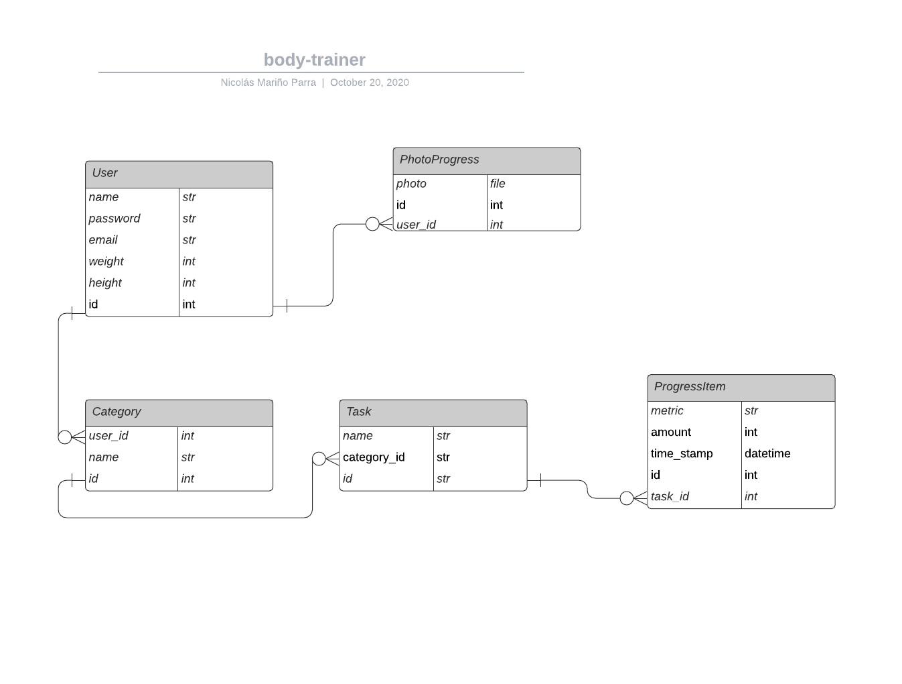

# Trainer App (Associations branch)

In this part I implemented the tests and associations based on this entity diagram.

## Open Endpoints

Open endpoints require no Authentication.

* [Login](login.md) : `POST /api/v1/login/`
* [Signup](Signup.md) : `POST /api/v1/Signup/`
* [logout](login.md) : `DELETE /api/v1/login/`

### Account related

* [Show info](category/get.md) : `GET /api/v1/user_id/`
* [Delete info](category/delete.md) : `DELETE /api/v1/user_id/`
* [Create info](category/post.md) : `POST /api/v1/user/`

* [Show info](task/get.md) : `GET /api/v1/user_id/categories/category_id/tasks/task_id`
* [Delete info](task/delete.md) : `DELETE /api/v1/user_id/categories/category_id/tasks/task_id`
* [Create info](task/post.md) : `POST /api/v1/user_id/categories/tasks`

* [Show info](task/get.md) : `GET /api/v1/user_id/categories/category_id/tasks/task_id/progress_items/progress_item_id`
* [Delete info](task/delete.md) : `DELETE /api/v1/user_id/categories/category_id/tasks/task_id/progress_items/progress_item_id`
* [Create info](task/post.md) : `POST /api/v1/user_id/categories/category_id/tasks/task_id/progress_items`
